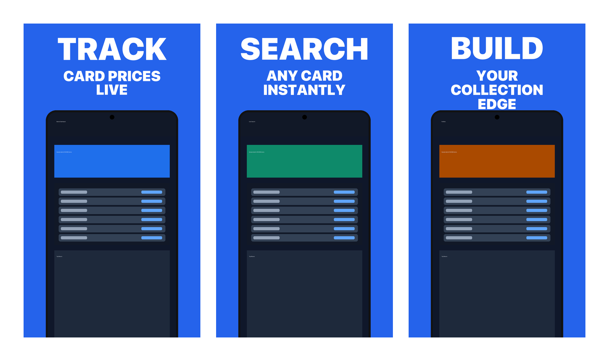
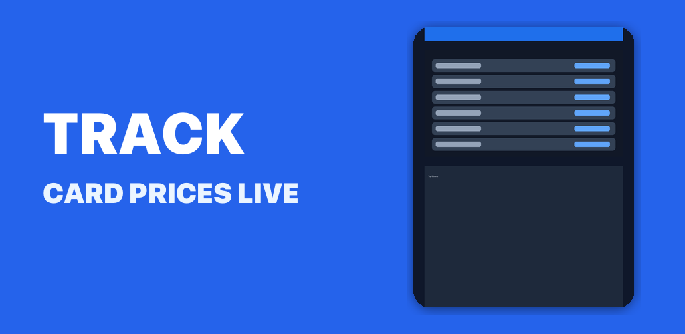

# App Screenshot Generator Skill

[](https://androidweekly.net/issues/723)

> Featured by Android Weekly for open-source developer tooling.

Create polished, high-converting **Google Play** screenshots with a reusable agent workflow.

Built for teams that want sharper store visuals without hand-designing every image.

## ✨ Preview

Sample screenshot set:



Sample Google Play feature graphic (`1024x500`):



The pipeline is Google Play-only:
- Google Play (Android portrait default: `1242x2208`)

## Highlights

- Discover the strongest app benefits to feature
- Pair each benefit with the right simulator screenshot
- Generate store-ready layouts with deterministic composition
- Optionally enhance final images with AI

## Credits

Adapted from Adam Lyttle's App Store-focused skill:
[claude-skill-aso-appstore-screenshots](https://github.com/adamlyttleapps/claude-skill-aso-appstore-screenshots)

## 📦 Repository Contents

- `SKILL.md`: Skill workflow and prompting logic.
- `compose.py`: Deterministic screenshot scaffold generator.
- `generate_feature_graphic.py`: Google Play feature graphic generator (`1024x500`).
- `generate_frame.py`: Device frame asset generator.
- `showcase.py`: Side-by-side preview generator.
- `assets/`: Frame templates used by the composer.

## ✅ Prerequisites

- Python 3.10+
- Pillow
- `rsync` (optional, used by the installer when available)
- SF Pro fonts on macOS (optional, recommended for best typography)
- Gemini MCP server for AI image enhancement (`@houtini/gemini-mcp`)

Install Python dependency:

```bash
pip install -r requirements.txt
```

Install Gemini MCP:

```bash
npm install -g @houtini/gemini-mcp
```

Then register it in your agent MCP config so image generation/edit tools are available.
Reference setup: [nicobailon/gemini-mcp](https://github.com/nicobailon/gemini-mcp)

## ⚙️ Install The Skill Locally

Use the helper installer (recommended):

```bash
./scripts/install-skill.sh both
```

Or install manually:

### Codex

```bash
mkdir -p ~/.codex/skills/aso-store-screenshots
cp -R . ~/.codex/skills/aso-store-screenshots
```

### Claude Code

```bash
mkdir -p ~/.claude/skills/aso-store-screenshots
cp -R . ~/.claude/skills/aso-store-screenshots
```

## 🧩 Platform Compatibility

This repo is structured to work across multiple agent platforms:

- Shared core workflow in `SKILL.md`
- Platform install targets handled by `scripts/install-skill.sh`
- Platform guidance and extension points in `docs/PLATFORMS.md`

Currently supported:
- Codex (`~/.codex/skills/<skill-name>`)
- Claude Code (`~/.claude/skills/<skill-name>`)

## 🚀 Quickstart

1. Install dependencies:

```bash
pip install -r requirements.txt
```

2. Install the skill:

```bash
./scripts/install-skill.sh both
```

3. Open your app project and invoke the skill:
- Claude Code: run `/aso-store-screenshots`
- Codex: ask the agent to use `aso-store-screenshots`

4. Follow the guided flow:
- identify benefits
- pair screenshots
- generate polished outputs

Runtime note:
- The current prompt workflow is authored for agents that support memory, image viewing, and image edit/generation tools via MCP or equivalent integrations.
- For command examples inside `SKILL.md`, treat `[installed skill directory]` as the location used by your agent, such as `~/.codex/skills/aso-store-screenshots` or `~/.claude/skills/aso-store-screenshots`.

## 🖼️ Sample Assets

This repo includes ready sample files for local testing:

- Input simulator screenshots: `samples/simulator/`
- Deterministic scaffold outputs: `samples/scaffolds/`
- Showcase preview (no footer link): `samples/showcase.png`
- Feature graphic sample (`1024x500`): `samples/feature-graphic.png`

Regenerate sample assets:

```bash
python3 scripts/generate-samples.py
python3 showcase.py \
  --screenshots samples/scaffolds/01-track-card-prices.png samples/scaffolds/02-search-any-card.png samples/scaffolds/03-build-collection.png \
  --output samples/showcase.png
```

`showcase.py` supports an optional footer link via `--github`, but it is omitted in the sample so the preview stays clean.

## 🛠️ Usage (Direct Scripts)

These scripts are optional utilities used by the skill pipeline. Most users should use the installed skill first, then drop to direct scripts only when they want tighter control.

Typical direct script usage:

```bash
python3 compose.py \
  --bg "#2563EB" \
  --verb "Track" \
  --desc "Card prices in real time" \
  --screenshot ./simulator/price-screen.png \
  --output ./screenshots/scaffold.png \
  --preset play-store-android
```

Generate/refresh frame assets:

```bash
python3 generate_frame.py
```

Generate a Google Play feature graphic (`1024x500`):

```bash
python3 generate_feature_graphic.py \
  --bg "#2563EB" \
  --title "TRACK" \
  --subtitle "CARD PRICES LIVE" \
  --screenshot ./simulator/price-screen.png \
  --output ./screenshots/feature-graphic.png
```

Resize generated variants to the exact Play Store target:

```bash
python3 scripts/resize_outputs.py \
  --target-w 1242 \
  --target-h 2208 \
  --inputs ./screenshots/01-track-card-prices/v1.jpg ./screenshots/01-track-card-prices/v2.jpg ./screenshots/01-track-card-prices/v3.jpg
```

Create showcase image:

```bash
python3 showcase.py \
  --screenshots ./screenshots/final/01.jpg ./screenshots/final/02.jpg ./screenshots/final/03.jpg \
  --output ./screenshots/showcase.png \
  --github "https://github.com/<your-org>/<your-repo>"
```

## 🔐 Open Source Notes

- Keep generated output (`screenshots/`) out of version control.
- Do not commit API keys, local MCP config, or private app screenshots.
- Review `SKILL.md` prompts if you want to tune tone, phase ordering, or quality bars.

## 📄 License

MIT (see `LICENSE`).
